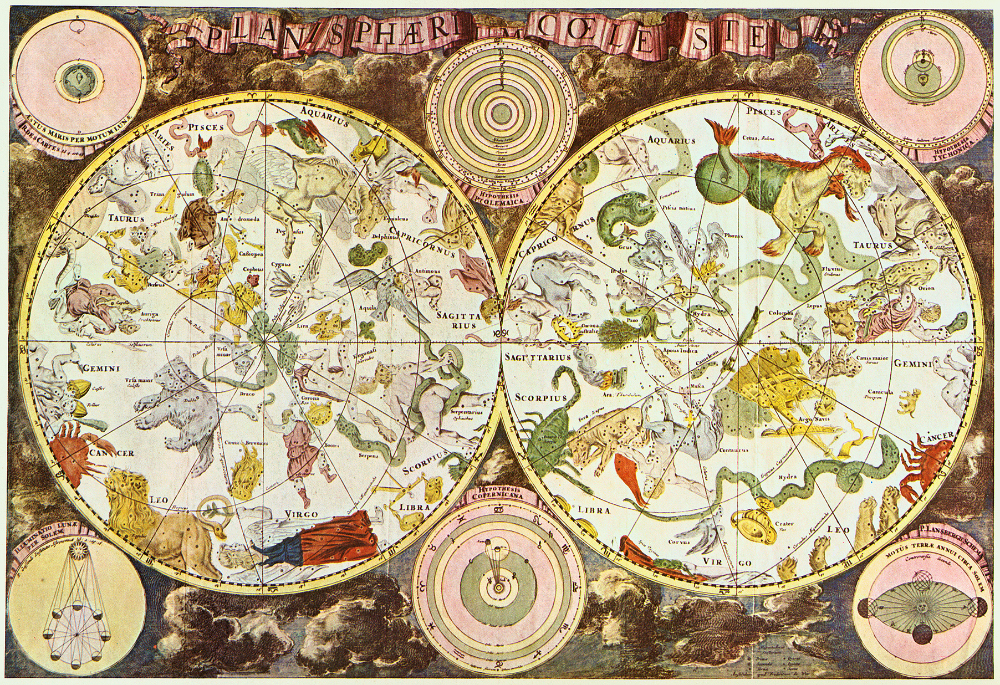
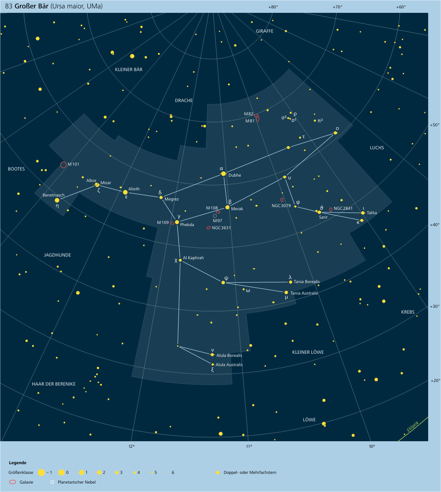
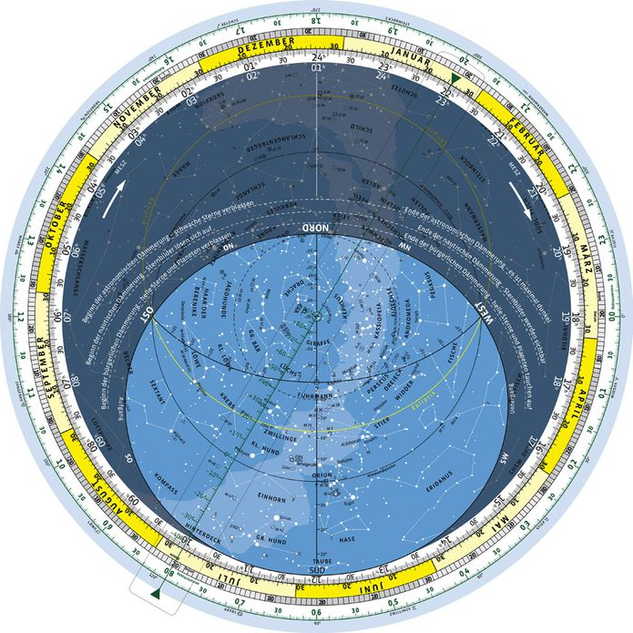
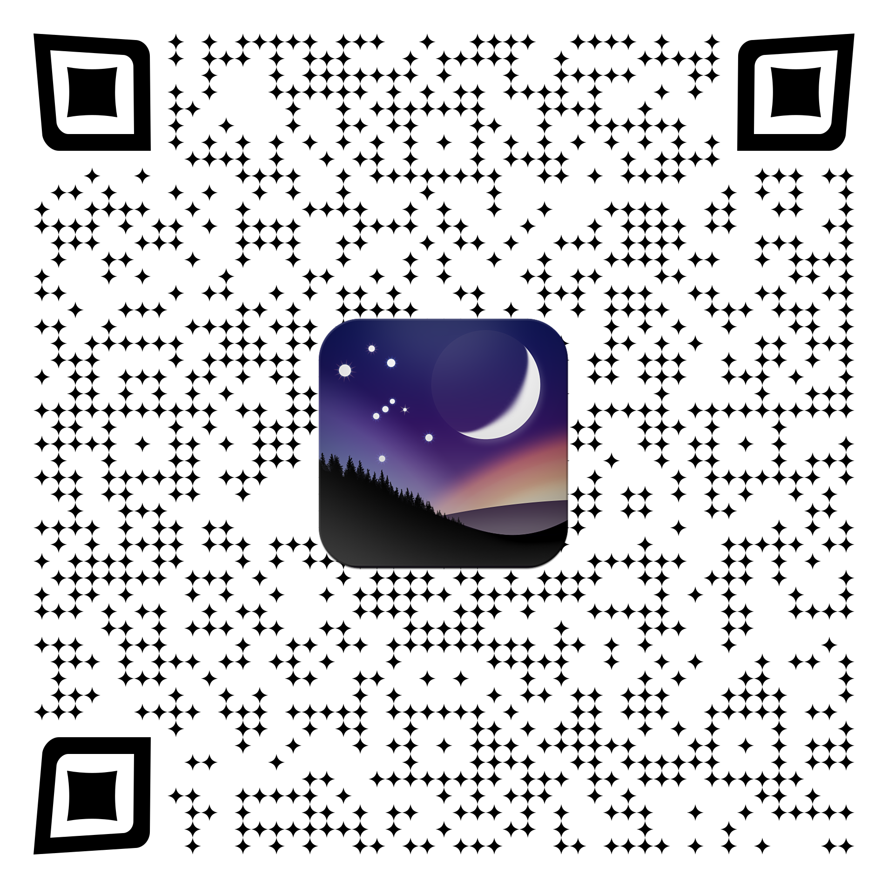
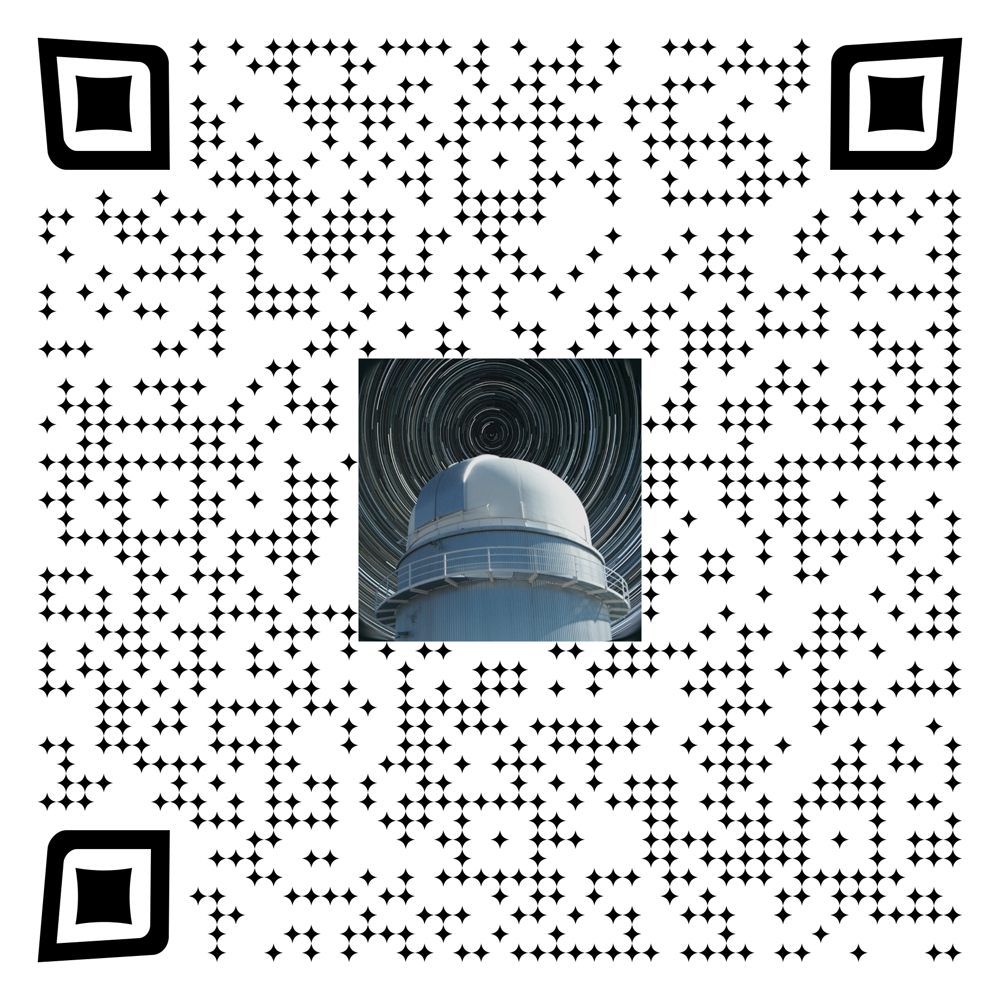

 
 
 
 

## Vortrag für die Schülerakademie Schulsternwarte EGG
# 2.1 Orientierung am Himmel
 
 
 
20.09.2022 - Luis Brandstätter - luis.brandstaetter@outlook.com

---

## Was lernt ihr heute?

1. Einführung
    1.1 Geschichte
    1.2 Arten von Himmelsobjekten
2. Orientierung am Nachthimmel
    2.1 Sternbilder, Beyer-Bezeichnung
    2.2 Nutzung von Sternkarten
    2.3 Deep Sky Kataloge
    2.4 Nützliche Software

---

# 1. Einführung 

----

## 1.1 Geschichte 

- Menschen waren schon immer fasziniert vom Sternhimmel 
- Jede Kultur hatte **eigene Benennung** von Sternen, Sternbildern (Götter, Kulte)

- Erste Kataloge: Alexandria, **300 v. Chr.** (Timocharis/Ptolemäus, nur mit bloßem Auge sichtbare Sterne)
- 16\. Jahrhundert: Beyer, Flamsteed (wenige Tsd. Sterne)
- Beispiele modernerer Sternenkataloge: 
    - **Messier** (1781, 110 Nebel und Galaxien)
    - Bonner Musterung 1852 (ohne Fotografie, 324k Sterne)
    - **NGC** (1888, 7k Sterne und Nebel) <!-- New General Catalogue of Nebulae and Clusters of Stars  -->

----

## 1.2 Arten von Himmelsobjekten

 

- im **Sonnensystem**: Planeten, Asteroiden, Kometen, Meteoriten
- **interstellare** Objekte: Sterne, Exoplaneten, Nebel, Sternhaufen
- **intergalaaktische** Objekte: Galaxien, Galaxienhaufen, schwarze Löcher, Quasare
- Alle Himmelsobjekte sind gemeinsam in den versch. Katalogen verzeichnet

----

# 2. Orientierung am Nachthimmel

----

## 2.1 Sternbilder, Beyer-Bezeichnung

- Sternbilder sind in jeder Kultur unterschiedlich bennant
- Beyer Katalog: 1690, mit dem Auge sichtbare sichtbare Sterne
- Wir benutzen für die **Bayer-Bezeichnung** die antik lateinischen/griechischen Abgrenzungen und Bezeichnungen (Bsp.: Orion (Orionis), Löwe (Leo), Großer Bär (Ursa Maior)...)
- Sterne werden nach ihrer **Helligkeit** sortiert und mit griechischen Buchstaben bezeichnet (Bsp.: $\alpha$, $\beta$, $\gamma$...)

 

⮡ *Sirius* (hellster Stern im Sternbild Hund): $\alpha$ CMa (Canis Majoris)
⮡ *Alpha Centauri* (hellster Stern im Sternbild Zentaur): $\alpha$ Cen (Centauri)
⮡ *Rigel* (momentan hellster Stern im Sternbild Orion, Veränderlicher!): $\beta$ Ori (Orionis)

----

## 2.2 Nutzung von Sternkarten

----

## 2.3 Deep Sky Kataloge

- **Messier** (1781, 110 Nebel und Galaxien)
- **GC** - General Catalogue (1864/87, von John Herschel)
- **NGC** - New General Catalogue (1888, erweiterung des GC)
- **IC** (1895/1908, Objekte die nach dem NGC Katalog entdeckt wurden)
- **CGCG** - Catalogue of Galaxies and of Clusters of Galaxies (1986, Fritz Zwicky)
- **UGC** - Uppsala General Catalogue (1973, besonders genaue Vermessungen)
- **Caldwell** (1995, 109 Deep-Sky Objekte für den Hobby-Astronomen)

 

⮡ *Andromeda-Galaxie*: M31, NGC/IC 224, UGC 454, CGCG 535-017, GC 116, ...

⮡ *Nordamerika Nebel*: NGC/IC 7000, GC 4621, Caldwell 20, ...

----

## 2.4 Nützliche Software

 

-  **Stellarium** (Planetariumssoftware, kostenlos für Windows, Mac, Linux, Android, iOS) 
 
-  **Mobile Observatory** (für Android, kostenlos oder kostenpflichtig)

----

 

Für PC: <a href="https://stellarium.org/de/">https://stellarium.org/de/</a>

----

# Danke für eure Aufmerksamkeit!

 

Folien auf: <a href="